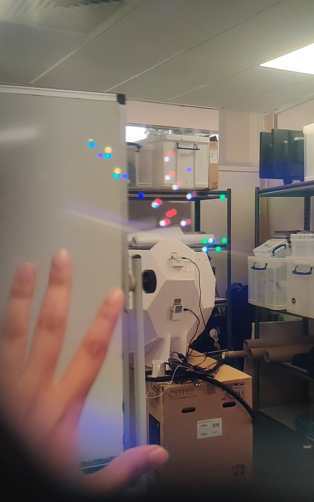
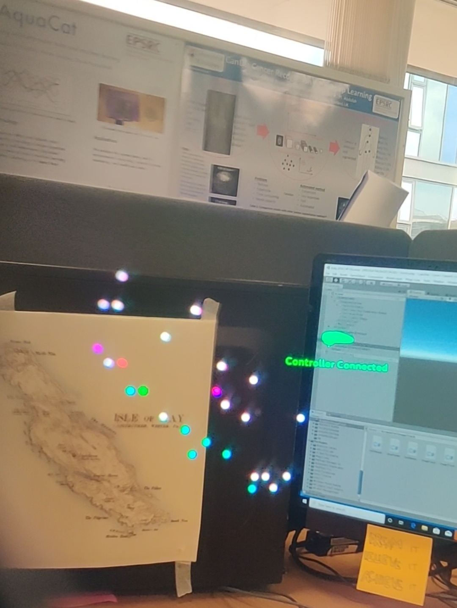

# Isle Of May

The Magic Leap system was used to build a 3D data visualization of the different species of birds that are present on the famous Isle Of May, Scotland. 

<table>
  <tr>
    <td></td>
    <td></td>
    <td></td>
  </tr>
</table>

# Details

## Current idea

The graph is plotted as soon as the Magic Leap camera tracks the image of the Isle of May map in the physical world. Once plotted, the graph can be moved around, zoomed in, zoomed out, rotated and placed on the table/floor for better interaction with individual data points. 

## Future development

When a data point is selected, it would enlarge and show the image of the species that it represents along with highlighting the other data points which represent the same species. 

# Data source

Static data is used in this application. The data was taken from https://data.gov.uk

# Real life usage

In the future, such applications can benefit the explorers who go to remote locations (which often do not have a reliable service recpetion) in the search of different species.
